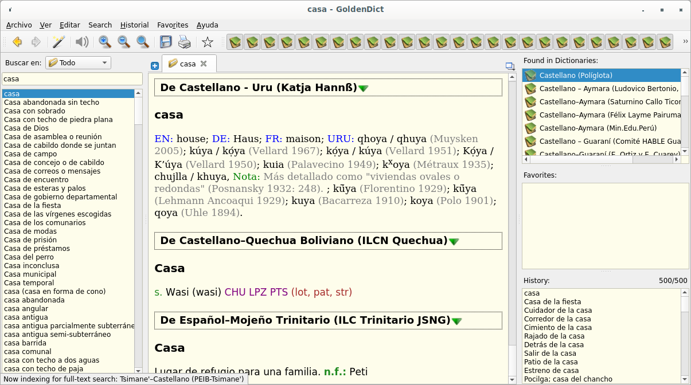
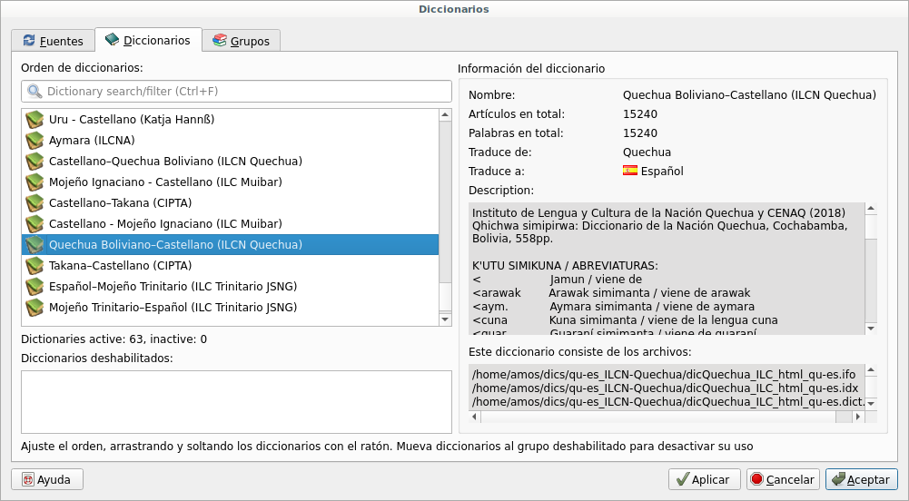
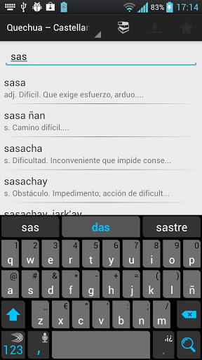
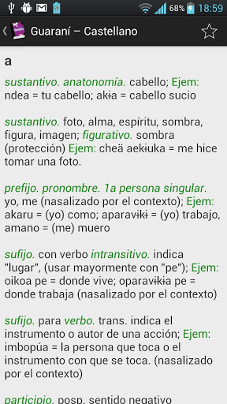
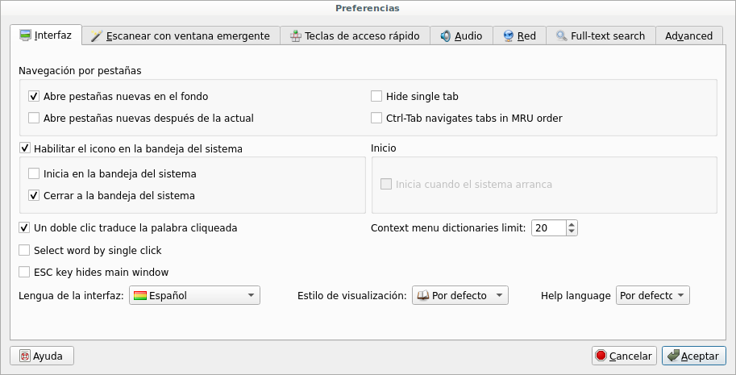
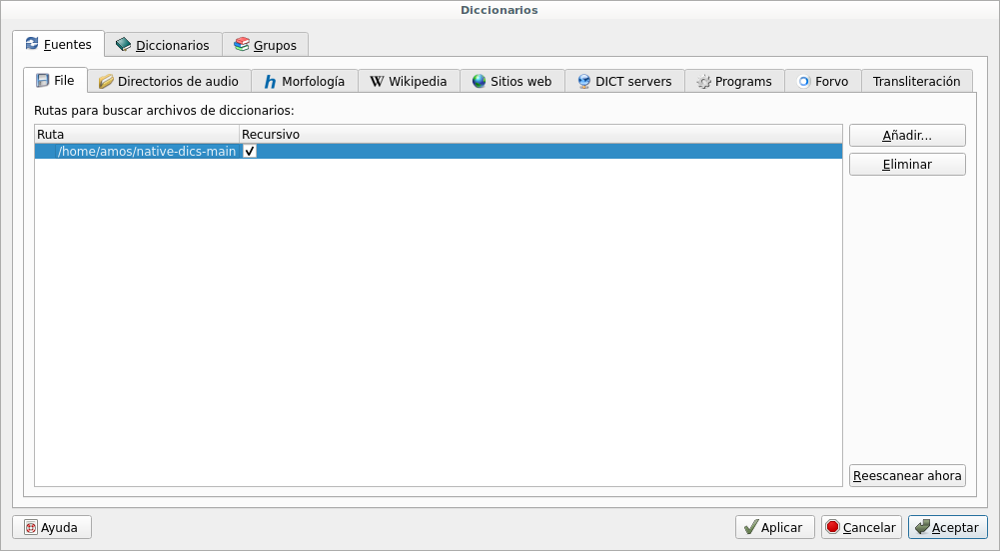

# native-dics

The following dictionaries of native languages can be used in GoldenDict (http://goldendict.org/) or StarDict (http://stardict-4.sourceforge.net/) on a PC running Linux or Windows. StarDict reportedly also works in Mac OS, but we haven't tried it.
 
These same dictionaries are also available in our Android app NuSimi (https://github.com/KetanoLab/NuSimi), which can be downloaded at the [Google Play Store](https://play.google.com/store/apps/details?id=com.ketanolab.nusimi) or [F-Droid](https://f-droid.org/en/packages/com.ketanolab.nusimi/).  

An older versión of our app named SimiDic (https://github.com/KetanoLab/SimiDic) is still available for older Android devices at the [Google Play Store](https://play.google.com/store/apps/details?id=com.ketanolab.simidic). 

See the instructions below to install these dictionaries in GoldenDict, StarDict, NuSimi y SimiDic. Download [dics.zip](https://github.com/amosbatto/native-dics/raw/main/dics.zip) and uncompress it to get all these dictionaries at once for GoldenDict or StarDict. Download [simidic.zip](https://github.com/amosbatto/native-dics/raw/main/simidic.zip) and decompress it to get these dictionaries for NuSimi or SimiDic.

If you would like us to format your dictionary to work in GoldenDict/StarDict/NuSimi/SimiDic, please contact Amos Batto (amosbatto@yahoo.com, cell: +591-76585096, Telegram: @amosbatto).

---

Los siguientes diccionarios de lenguas originarias pueden ser utilizados en GoldenDict (http://goldendict.org/) o StarDict (http://stardict-4.sourceforge.net/) en un PC con Linux o Windows. StarDict también funciona en MacOS, pero nunca lo hemos probado.

Estos diccionarios también son disponibles en nuestra app de Android, que es NuSimi (https://github.com/KetanoLab/NuSimi) y puede ser descargado en el [Google Play Store](https://play.google.com/store/apps/details?id=com.ketanolab.nusimi) y [F-Droid](https://f-droid.org/es/packages/com.ketanolab.nusimi/).

Una versión más antigua de nuestra app nombrada SimiDic (https://github.com/KetanoLab/SimiDic) todavía está disponible para versiones antiguas de Android en el [Google Play Store](https://play.google.com/store/apps/details?id=com.ketanolab.simidic).

 

Ver las instrucciones abajo para instalar estos diccionarios en GoldenDict, StarDict, NuSimi y SimiDic. Descargue [dics.zip](https://github.com/amosbatto/native-dics/raw/main/dics.zip) y descómprimalo para conseguir todos estos diccionarios a la vez para utilizarlos en GoldenDict o StarDict. Descargue [simidic.zip](https://github.com/amosbatto/native-dics/raw/main/simidic.zip) y y descómprimalo para conseguir estos diccionarios para utilizarlos en NuSimi o SimiDic.

Si Ud. quiere que formateemos su diccionario para funcionar en GoldenDict/StarDict/Nusimi/SimiDic, por favor contactar con Amos Batto (amosbatto@yahoo.com, cel: +591-76585096, Telegram: @amosbatto).

## Available dictionaries / Diccionarios disponibles

**AYMARA:**
* Saturnino Callo Ticona, ***Diccionario Aymara-Castellano y Castellano-Aymara “KAMISARAKI”***, segunda edición, Tacna, Perú, 507pp. [`dics/ay_es-callo`](https://github.com/amosbatto/native-dics/tree/main/dics/ay_es-callo), [`dics/es_ay-callo`](https://github.com/amosbatto/native-dics/tree/main/dics/es_ay-callo), [`simidic/ay_es_sa.db`](https://github.com/amosbatto/native-dics/raw/main/simidic/ay_es_sa.db), [`simidic/es_ay_sa.db`](https://github.com/amosbatto/native-dics/raw/main/simidic/es_ay_sa.db)
* Gregorio Callisaya A., et al., ***Glosario de nuevos términos aimaras***, Universidad Mayor de San Andres, Tecnologias de Información y Comunicación (UMSATIC), La Paz, Bolivia, s/f, 18pp. [`dics/es_ay-callisaya-html`](https://github.com/amosbatto/native-dics/tree/main/dics/es_ay-callisaya-html), [`simidic/es_ay_gr.db`](https://github.com/amosbatto/native-dics/raw/main/simidic/es_ay_gr.db)
* Ludovico Bertonio, ***Vocabulario de la Lengua Aymara***, Juli, Perú, 1612, con ortografía actualizada por Radio San Gabriel y digitalizada por ILLA-A. [`dics/es_ay-bertonio`](https://github.com/amosbatto/native-dics/tree/main/dics/es_ay-bertonio)
* Félix Layme Pairumani, ***Diccionario Bilingüe: Aymara-Castellano***, quinta edición preliminar, La Paz, Bolivia, 2011, 509pp. [`dics/ay_es-layme`](https://github.com/amosbatto/native-dics/tree/main/dics/ay_es-layme), [`dics/es_ay-layme`](https://github.com/amosbatto/native-dics/tree/main/dics/es_ay-layme), [`simidic/ay_es_fe.db`](https://github.com/amosbatto/native-dics/raw/main/simidic/ay_es_fe.db), [`simidic/es_ay_fe.db`](https://github.com/amosbatto/native-dics/raw/main/simidic/es_ay_fe.db) 
* N. Apaza Suca, D. Condori Cruz, M. N. Ramos Rojas, ***Yatiqirinaka Aru Pirwa, Qullawa Aymara Aru***, Ministerio de Educación, Lima, Perú, 2005, 141pp. [`dics/ay-min-edu-peru-pango`](https://github.com/amosbatto/native-dics/tree/main/dics/ay-min-edu-peru-pango), [`dics/es_ay-min-edu-peru`](https://github.com/amosbatto/native-dics/tree/main/dics/es_ay-min-edu-peru), [`simidic/ay_ay_ed.db`](https://github.com/amosbatto/native-dics/raw/main/simidic/ay_ay_ed.db), [`simidic/es_ay_ed.db`](https://github.com/amosbatto/native-dics/raw/main/simidic/es_ay_ed.db)
* Instituto de Lengua y Cultura de la Nación Aymara (ILCNA) ***Aru Pirwa Aymara,*** 2021, El Alto, Bolivia. [`dics/aym_aym-ilcn-aymara`](https://github.com/amosbatto/native-dics/tree/main/dics/aym_aym-ilcn-aymara), [`simidic/ay_ay_in.db`](https://github.com/amosbatto/native-dics/raw/main/simidic/ay_ay_in.db)

**AYMARA-GUARANÍ-QUECHUA:**
* Salustiano Ayma, José Barrientos, Gladys Márquez F., ***ARUSIMIÑEE: castellano, aymara, guaraní, qhichwa***, Ministerio de Educación, La Paz, Bolivia, 2004, 93pp. [`dics/ay-arusiminee`](https://github.com/amosbatto/native-dics/tree/main/dics/ay-arusiminee), [`dics/gu-arusiminee`](https://github.com/amosbatto/native-dics/tree/main/dics/gu-arusiminee), [`dics/qu-arusiminee`](https://github.com/amosbatto/native-dics/tree/main/dics/qu-arusiminee), [`dics/es-arusiminee`](https://github.com/amosbatto/native-dics/tree/main/dics/es-arusiminee), [`simidic/es_qu_mi.db`](https://github.com/amosbatto/native-dics/raw/main/simidic/es_qu_mi.db), [`simidic/qu_es_mi.db`](https://github.com/amosbatto/native-dics/raw/main/simidic/qu_es_mi.db), [`simidic/ay_es_mi.db`](https://github.com/amosbatto/native-dics/raw/main/simidic/ay_es_mi.db), [`simidic/gn_es_mi.db`](https://github.com/amosbatto/native-dics/raw/main/simidic/gn_es_mi.db)

**GUARANÍ:**
* Comité HABLE Guaraní, ***Rɨru Ñaneñee Diccionario: Guaraní – Castellano***, 2a ed. Charagua, Santa Cruz, Bolivia, 1996., segunda edición, Charagua, Santa Cruz, Bolivia, 2011, 258pp. [`dics/gu_es-hable-guarani`](https://github.com/amosbatto/native-dics/tree/main/dics/gu_es-hable-guarani), [`dics/es_gu-hable-guarani`](https://github.com/amosbatto/native-dics/tree/main/dics/es_gu-hable-guarani), [`simidic/gn_es_co.db`](https://github.com/amosbatto/native-dics/raw/main/simidic/gn_es_co.db), [`simidic/es_gn_co.db`](https://github.com/amosbatto/native-dics/raw/main/simidic/es_gn_co.db)
* Elio Ortiz y Elías Caurey, ***Diccionario etimológico y etnográfico de la lengua guaraní hablada en Bolivia (Guaraní-Español)***, Plural Editores, La Paz, Bolivia, 2011, 474pp. [`es_gu-ortiz-caurey`](https://github.com/amosbatto/native-dics/tree/main/dics/es_gu-ortiz-caurey), [`gu_es-ortiz-caurey`](https://github.com/amosbatto/native-dics/tree/main/dics/gu_es-ortiz-caurey), [`simidic/gn_es_el.db`](https://github.com/amosbatto/native-dics/raw/main/simidic/gn_es_el.db), [`simidic/es_gn_el.db`](https://github.com/amosbatto/native-dics/raw/main/simidic/es_gn_el.db)

**MAPUCHE (MAPUZUGUN):**
* Equipo de Educación Mapuche Wixaleyiñ, ***Vocabulario Mapuche-Castellano***, http://sites.google.com/site/wixaleyin (2013), 96pp. [`map_es-wixaleyin-html`](https://github.com/amosbatto/native-dics/tree/main/dics/map_es-wixaleyin-html), [`es_map-wixaleyin-html`](https://github.com/amosbatto/native-dics/tree/main/dics/es_map-wixaleyin-html), [`simidic/ma_es_wi.db`](https://github.com/amosbatto/native-dics/raw/main/simidic/ma_es_wi.db), [`simidic/es_ma_wi.db`](https://github.com/amosbatto/native-dics/raw/main/simidic/es_ma_wi.db)

**MOCHÓ (MAYA):**
* Alonso Guzmán, ***Manual Mochó***, Chiapas, México, 2004. [`dics/mhc_es-guzman`](https://github.com/amosbatto/native-dics/tree/main/dics/mhc_es-guzman), [`dics/es_mhc-guzman`](https://github.com/amosbatto/native-dics/tree/main/dics/es_mhc-guzman), [`simidic/es_mc_al.db`](https://github.com/amosbatto/native-dics/raw/main/simidic/es_mc_al.db)

**MOJEÑO IGNACIANO:**
* Instituto de Lengua y Cultura Mojeño Ignaciano “Salvador Chappy Muibar”, ***Diccionario Mojeño Ignaciano***, San Ignacio de Moxos, Bolivia, 2021. [`dics/ign_es-ilc-mojeno-ignaciano`](https://github.com/amosbatto/native-dics/tree/main/dics/ign_es-ilc-mojeno-ignaciano), [`dics/es_ign-ilc-mojeno-ignaciano`](https://github.com/amosbatto/native-dics/tree/main/dics/es_ign-ilc-mojeno-ignaciano), [`simidic/ig_es_in.db`](https://github.com/amosbatto/native-dics/raw/main/simidic/ig_es_in.db), [`simidic/es_ig_in.db`](https://github.com/amosbatto/native-dics/raw/main/simidic/es_ig_in.db)

**MOJEÑO TRINITARIO:**
* Instituto de Lengua y Cultura Mojeño Trinitario “José Santos Noco Guaji”, ***Taechirawkoriono Vechjiriiwo Trinranono: Diccionario Idioma Trinitario***, Santa Cruz, Bolivia, 2021, 130pp. [`dics/trn-es_ilc-mojeño-trinitario`](https://github.com/amosbatto/native-dics/tree/main/dics/trn_es-ilc-mojeno-trinitario), [`dics/es_trn-ilc-mojeno-trinitario`](https://github.com/amosbatto/native-dics/tree/main/dics/es_trn-ilc-mojeno-trinitario), [`simidic/tr_es_in.db`](https://github.com/amosbatto/native-dics/raw/main/simidic/tr_es_in.db), [`simidic/es_tr_in.db`](https://github.com/amosbatto/native-dics/raw/main/simidic/es_tr_in.db)

**MOSETÉN:**
* Abel Maito Canare, et al., ***Kirjka pheyakdye’ tïmsi’ tsinsi’khan kastellanokhan: Diccionario Mosetén-Castellano, Castellano-Mosetén***, Organización de los Pueblos Indígenas Mosetén (OPIM), UMSS, PROEIB Andes, Bolivia, 2011, 132pp. *Nota: Para visualizar mejor el texto, descargue y instale la fuente [Charis SIL](https://software.sil.org/charis/download/).* [`dics/mos_es-opim-html`](https://github.com/amosbatto/native-dics/tree/main/dics/mos_es-opim-html), [`dics/es_mos-opim-html`](https://github.com/amosbatto/native-dics/tree/main/dics/es_mos-opim-html), [`simidic/mo_es_or.db`](https://github.com/amosbatto/native-dics/raw/main/simidic/mo_es_or.db), [`simidic/es_mo_or.db`](https://github.com/amosbatto/native-dics/raw/main/simidic/es_mo_or.db)

**MOVIMA:**
* Melvin Rossel Yoqui, et al., ***Diccionario Movima***, Programa de Educación Intercultural Bilingüe-Movima, Santa Cruz (2007), 72pp. [`dics/es_mov-peib-movima`](https://github.com/amosbatto/native-dics/tree/main/dics/es_mov-peib-movima), [`dics/mov_es-peib-movima`](https://github.com/amosbatto/native-dics/tree/main/dics/mov_es-peib-movima), [`simidic/mo_es_pe.db`](https://github.com/amosbatto/native-dics/raw/main/simidic/mo_es_pe.db), [`simidic/es_mo_pe.db`](https://github.com/amosbatto/native-dics/raw/main/simidic/es_mo_pe.db)

**QUECHUA:**
* Academia Mayor de La Lengua Quechua, ***Diccionario: Quechua – Español – Quechua, Qheswa – Español – Qheswa: Simi Taqe***, 2da ed., Cusco, Perú, 2005, 313pp. [`dics/qu_es-amlq`](https://github.com/amosbatto/native-dics/tree/main/dics/qu_es-amlq), [`dics/es_qu-amlq`](https://github.com/amosbatto/native-dics/tree/main/dics/es_qu-amlq), [`simidic/es_qu_am.db`](https://github.com/amosbatto/native-dics/raw/main/simidic/es_qu_am.db), [`simidic/qu_es_am.db`](https://github.com/amosbatto/native-dics/raw/main/simidic/qu_es_am.db)
* Teófilo Laime Ajacopa, Efraín Cazazola y Felix Layme Pairumani, ***Iskay simipi yuyayk’ancha: Quechua – Castellano, Castellano – Quechua***, 2a ed. mejorada (versión preliminar), La Paz, Bolivia, enero 2007, 212pp. [`dics/qu_es-laime`](https://github.com/amosbatto/native-dics/tree/main/dics/qu_es-laime), [`dics/es_qu-laime`](https://github.com/amosbatto/native-dics/tree/main/dics/es_qu-laime), [`simidic/qu_es_te.db`](https://github.com/amosbatto/native-dics/raw/main/simidic/qu_es_te.db), [`simidic/es_qu_te.db`](https://github.com/amosbatto/native-dics/raw/main/simidic/es_qu_te.db)
* Diego González Holguín, ***Vocabvlario de la Lengva General de todo Perv llamada lengua Qquichua, o del Inca***, Lima, Perú, 1608, digitalizado por Runasimipi.org, 2007, 427pp. [`dics/es_qu-holguin`](https://github.com/amosbatto/native-dics/tree/main/dics/es_qu-holguin), [`dics/qu_es-holguin`](https://github.com/amosbatto/native-dics/tree/main/dics/qu_es-holguin), [`simidic/qu_es_di.db`](https://github.com/amosbatto/native-dics/raw/main/simidic/qu_es_di.db), [`simidic/es_qu_di.db`](https://github.com/amosbatto/native-dics/raw/main/simidic/es_qu_di.db)
* Rodolfo Cerrón-Palomino, ***Quechua Sureño: Diccionario Unificado***, Biblioteca Nacional del Perú: Lima, 1994, 139pp. [`dics/es_qu-cerron`](https://github.com/amosbatto/native-dics/tree/main/dics/es_qu-cerron), [`dics/qu_es-cerron`](https://github.com/amosbatto/native-dics/tree/main/dics/qu_es-cerron), [`simidic/qu_es_ro.db`](https://github.com/amosbatto/native-dics/raw/main/simidic/qu_es_ro.db), [`simidic/es_qu_ro.db`](https://github.com/amosbatto/native-dics/raw/main/simidic/es_qu_ro.db) 
* Leoncio Gutiérrez Camacho, Leonidas Mantilla Gutiérrez y Shara Huaman Jullunila, ***Apurimaqpaq Runasimi Taqe, Diccionario de Quechua Apurimeño***, Versión Preliminar, Academia Mayor de la Lengua Quechua filial Apurímac, Abancay, Perú, feb. 2007, pp 130. [`dics/es_qu-apurimac`](https://github.com/amosbatto/native-dics/tree/main/dics/es_qu-apurimac), [`dics/qu_es-apurimac`](https://github.com/amosbatto/native-dics/tree/main/dics/qu_es-apurimac), [`simidic/qu_es_ac.db`](https://github.com/amosbatto/native-dics/raw/main/simidic/qu_es_ac.db), [`simidic/es_qu_ac.db`](https://github.com/amosbatto/native-dics/raw/main/simidic/es_qu_ac.db)   
* Nonato Rufino Chuquimamani Valer, ***Yachakuqkunapaq Simi Qullqa, Qusqu Qullaw, Chichwa Simipi***, Ministerio de Educación, Lima, Perú, 2005, 218pp. [`dics/qu-cuzco-min-ed-peru-pango`](https://github.com/amosbatto/native-dics/tree/main/dics/qu-cuzco-min-ed-peru-pango), [`dics/es_qu-cuzco-min-ed-peru`](https://github.com/amosbatto/native-dics/tree/main/dics/es_qu-cuzco-min-ed-peru), [`simidic/qz_qz_ed.db`](https://github.com/amosbatto/native-dics/raw/main/simidic/qz_qz_ed.db), [`simidic/es_qz_ed.db`](https://github.com/amosbatto/native-dics/raw/main/simidic/es_qz_ed.db)
* G. Palomino Rojas y G. R. Quintero Bendezú, ***Yachakuqkunapa Simi Qullqa, Ayakuchu Chanka, Qichwa Simipi***, Ministerio de Educación, Lima, Perú, 2005, 145 pp. [`dics/es_qu-ayacucho-min-ed-peru`](https://github.com/amosbatto/native-dics/tree/main/dics/es_qu-ayacucho-min-ed-peru), [`dics/qu-ayacucho-min-ed-peru-pango`](https://github.com/amosbatto/native-dics/tree/main/dics/qu-ayacucho-min-ed-peru-pango), [`simidic/qy_qy_ed.db`](https://github.com/amosbatto/native-dics/raw/main/simidic/qy_qy_ed.db), [`simidic/es_qy_ed.db`](https://github.com/amosbatto/native-dics/raw/main/simidic/es_qy_ed.db)
* Leonel Alexander Menacho López, ***Yachakuqkunapa Shimi Qullqa, Anqash Qichwa Shimichaw***, Ministerio de Educación, Lima, Perú, 2005, 131 pp. [`dics/qu-ancash-min-ed-peru-pango`](https://github.com/amosbatto/native-dics/tree/main/dics/qu-ancash-min-ed-peru-pango), [`dics/es_qu-ancash-min-ed-peru`](https://github.com/amosbatto/native-dics/tree/main/dics/es_qu-ancash-min-ed-peru), [`simidic/qn_qn_ed.db`](https://github.com/amosbatto/native-dics/raw/main/simidic/qn_qn_ed.db), [`simidic/es_qn_ed.db`](https://github.com/amosbatto/native-dics/raw/main/simidic/es_qn_ed.db)
* Joaquín Herrero S.J. y Federico Sánchez de Lozada, ***Diccionario Quechua: Estructura semántica del quechua cochabambino contemporáneo***, Cochabamba, Bolivia, 1983, 581pp, http://quechua.ucla.edu/dictionaries [`dics/qu-es-herrero-sanchez-html`](https://github.com/amosbatto/native-dics/tree/main/dics/qu-es-herrero-sanchez-html), [`dics/simidic/qu_es_jo.db`](https://github.com/amosbatto/native-dics/raw/main/simidic/qu_es_jo.db)
* Instituto de Lengua y Cultura de la Nación Quechua y CENAQ, ***Qhichwa simipirwa: Diccionario de la Nación Quechua***, Cochabamba, Bolivia, 2018, 558pp. [`dics/qu_es-ilcn-quechua`](https://github.com/amosbatto/native-dics/tree/main/dics/qu_es-ilcn-quechua), [`es_qu-ilcn-quechua`](https://github.com/amosbatto/native-dics/tree/main/dics/es_qu-ilcn-quechua), [`simidic/qu_es_in.db`](https://github.com/amosbatto/native-dics/raw/main/simidic/qu_es_in.db), [`simidic/es_qu_in.db`](https://github.com/amosbatto/native-dics/raw/main/simidic/es_qu_in.db)

**QUECHUA-AYMARA:**
* Franciscanos Misioneros de los Colegios Propaganda Fide del Peru, ***Diccionario Poliglota Incaico: comprende más de 12,000 voces castellanas y 100,000 de keshua del Cuzco, Ayacucho, Junín, Ancash y Aymará***, Edición Ministerio de Educación, Lima, Perú, [1905] 1998, 551pp. [`dics/qu-cuzco-poliglota-pango`](https://github.com/amosbatto/native-dics/tree/main/dics/qu-cuzco-poliglota-pango), [`dics/qu-ayacucho-poliglota-pango`](https://github.com/amosbatto/native-dics/tree/main/dics/qu-ayacucho-poliglota-pango), [`dics/qu-ancash-poliglota-pango`](https://github.com/amosbatto/native-dics/tree/main/dics/qu-ancash-poliglota-pango), [`dics/qu-junin-poliglota-pango`](https://github.com/amosbatto/native-dics/tree/main/dics/qu-junin-poliglota-pango), [`simidic/es_po_fr.db`](https://github.com/amosbatto/native-dics/raw/main/simidic/es_po_fr.db) (castellano), [`simidic/qz_po_fr.db`](https://github.com/amosbatto/native-dics/raw/main/simidic/qz_po_fr.db) (Cuzco), [`simidic/qy_po_fr.db`](https://github.com/amosbatto/native-dics/raw/main/simidic/qy_po_fr.db) (Ayacucho), [`simidic/qn_po_fr.db`](https://github.com/amosbatto/native-dics/raw/main/simidic/qn_po_fr.db) (Ancash), [`simidic/qj_po_fr.db`](https://github.com/amosbatto/native-dics/raw/main/simidic/qj_po_fr.db) (Junín), [`simidic/ay_po_fr.db`](https://github.com/amosbatto/native-dics/raw/main/simidic/ay_po_fr.db) (aymara) 

**TAKANA:**
* Alejandro Marupa Beyuma, et al., ***Mimi butsepi Takana-Kastillanu, Kastillanu-Takana: Diccionario Takana-Castellano, Castellano-Takana***, Consejo Indígena de los Pueblos Takana (CIPTA), UMSS, PROEIB Andes, Bolivia, 2011, 206pp. [`dics/tak_es-cipta-html`](https://github.com/amosbatto/native-dics/tree/main/dics/tak_es-cipta-html), [`dics/es_tak-cipta-html`](https://github.com/amosbatto/native-dics/tree/main/dics/es_tak-cipta-html), [`simidic/ta_es_ci.db`](https://github.com/amosbatto/native-dics/raw/main/simidic/ta_es_ci.db), [`simidic/es_ta_ci.db`](https://github.com/amosbatto/native-dics/raw/main/simidic/es_ta_ci.db)

**TSIMANE’ (Chimané):**
* Cándido Nery, et al., ***Diccionario Tsimane’***, Programa de Educación Intercultural Bilingüe-Tsimane’, Santa Cruz (2007), 161pp. *Nota: Para visualizar mejor el texto, descargue y instale la fuente [Doulos SIL](https://software.sil.org/doulos/download/).* [`dics/es_tsi-peib-tsimane`](https://github.com/amosbatto/native-dics/tree/main/dics/es_tsi-peib-tsimane), [`dics/tsi_es-peib-tsimane`](https://github.com/amosbatto/native-dics/tree/main/dics/tsi_es-peib-tsimane), [`simidic/ts_es_pe.db`](https://github.com/amosbatto/native-dics/raw/main/simidic/ts_es_pe.db), [`simidic/es_ts_pe.db`](https://github.com/amosbatto/native-dics/raw/main/simidic/es_ts_pe.db) 

**URU (Uchumataqu):**
* Kajta Hannß, ***Vocabulario Uru (Uchumataqu): Castellano/English/Deutsch/Français – Uru***, 2013. *Nota: Para visualizar mejor el texto, descargue y instale la fuente [Doulos SIL](https://software.sil.org/doulos/download/).* [`dics/uru_es-hannss-html`](https://github.com/amosbatto/native-dics/tree/main/dics/uru_es-hannss-html), [`dics/es_uru-hannss-html`](https://github.com/amosbatto/native-dics/tree/main/dics/es_uru-hannss-html), [`dics/fr_uru-hannss-html`](https://github.com/amosbatto/native-dics/tree/main/dics/fr_uru-hannss-html), [`dics/de_uru-hannss-html`](https://github.com/amosbatto/native-dics/tree/main/dics/de_uru-hannss-html), [`dics/en_uru-hannss-html`](https://github.com/amosbatto/native-dics/tree/main/dics/en_uru-hannss-html), [`simidic/ur_es_kh.db`](https://github.com/amosbatto/native-dics/raw/main/simidic/ur_es_kh.db) (uru), [`simidic/es_ur_kh.db`](https://github.com/amosbatto/native-dics/raw/main/simidic/es_ur_kh.db) (castellano), [`simidic/en_ur_kh.db`](https://github.com/amosbatto/native-dics/raw/main/simidic/en_ur_kh.db) (inglés), [`simidic/de_ur_kh.db`](https://github.com/amosbatto/native-dics/raw/main/simidic/de_ur_kh.db) (alemán), [`simidic/fr_ur_kh.db`](https://github.com/amosbatto/native-dics/raw/main/simidic/fr_ur_kh.db) (francés)

## GoldenDict - desktop application / applicación de escritorio

It is recommended to install the latest development version of GoldenDict, which is already packaged in most Linux distributions. 

For example, the following command installs GoldenDict in Debian/Ubuntu/Mint:  
`sudo apt install goldendict`

For Windows, it is recommended to download the [GoldenDict 1.5.0rc2 installer](https://sourceforge.net/projects/goldendict/files/early%20access%20builds/GoldenDict-1.5.0-RC2-372-gc3ff15f-Install.exe/download)

To use these dictionaries in GoldenDict on a PC, download the directories of the dictionaries that you want to use and copy those directories to any location on your local computer. Then, open GoldenDict and go to **Edit > Dictionaries** in the menu. In the "**Dictionaries**" dialog box that opens, go to the **Sources** tab and then the **Files** sub-tab. Then, click on the **Add** button to add a new path. Then enter the path where you stored the directories of the dictionaries. Also remember to mark the **Recursive** option for that path. Then click on the **Rescan Now** button so the dictionaries will immediately be added to GoldenDict or restart GoldenDict so it will scan for the new dictionaries when starting.

---

Se recomienda instalar la última versión de GoldenDict en desarrollo, que ya está empaquetada en la mayoria de las distribuciones de Linux. 

Por ejemplo el siguiente comando instala GoldenDict en Debian/Ubuntu/Mint:  
`sudo apt install goldendict`

Para Windows, se recomienda descargar el [instalador de GoldenDict 1.5.0rc2](https://sourceforge.net/projects/goldendict/files/early%20access%20builds/GoldenDict-1.5.0-RC2-372-gc3ff15f-Install.exe/download)

Para cambiar la interfaz a castellano, se puede ir a **Edit > Preferences** (**Editar > Preferencias**) en el menú y seleccionar "Español" en el cuadro desplegable **Interface language** (**Lengua de la interfaz**) en el diálogo de preferencias.

Para utilizar estos diccionarios en GoldenDict en un PC, descargue los directorios que Ud. quiere y copie esos directorios a cualquier ubicación en su computadora. Luego abra GoldenDict y vaya a **Editar > Diccionarios** (**Edit > Dictionaries**) en el menú. En el diálogo "**Diccionarios**" ("**Dictionaries**") que abre, vaya a la pestaña **Fuentes** (**Sources**) y la sub-pestaña **Ficheros** (**Files**). Luego haga clic en el botón **Añadir** (**Add**) para agregar una ruta nueva. Luego introducir la ruta donde Ud. ha guardado los directorios de los diccionarios en su conputadora. También marque la opción **Recursiva** (**Recursive**) de esta ruta. Luego haga clic en el botón **Reescanear ahora** (**Rescan Now**) para incorporar los diccionarios inmediatemente en GoldenDict o reinciar GoldenDict para incorporar los diccionarios nuevos al inicio.

## StarDict - desktop application / applicación de escritorio

GoldenDict is recommended over StarDict, since it is a newer program with a better interface. To use these dictionaries in StarDict on a PC, download the directories of the dictionaries that you want to use and copy those directories into the **`dic`** directory of StarDict.  

In Windows, it is generally located at:  
`C:/Program Files\stardict\dic` *or* `C:\Program Files (x86)\stardict\dic`

In Linux, it is generally located at:  
`/usr/share/stardict/dic`

**Note:** you will need to use **`su`** or **`sudo`** to get root access to copy the files into this location in Linux.

The next time that StarDict is started, it should automatically find the dictionaries and you can search in the dictionaries.

---

GoldenDict es mas recomendado que StarDict, ya que es un programa más nuevo con una interfaz más amable. Para utilizar estos diccionarios en StarDict en Windows, Linux o Mac OS, descargue los directorios de los diccionarios que Ud. quiere y copie esos directories en el directorio **`dic`** de StarDict.  

En Windows, generalmente se ubica en:  
`C:/Program Files\stardict\dic`, `C:\Program Files (x86)\stardict\dic`,  `C:\Archivos de programa\stardict\dic` *o* `C:\Archivos de programa (x86)\stardict\dic`

En Linux, generalmente se ubica en:
`/usr/share/stardict/dic`

**Nota:** Se puede usar **`su`** o **`sudo`** para obtener acceso de root y copiar los archivos a esa ruta en Linux.

La próxima vez que StarDict es iniciado, debería encontrar automáticamente los nuevos diccionarios instalados.

## NuSimi - Android app / app de Android

NuSimi is a dictionary app with a free/open source license ([GPL 3.0](https://www.gnu.org/licenses/gpl-3.0.en.html) or later) that can be installed in Android 5 and later. "*Nusimi*" means "my language", when combining *nu* ("my") from Mojeño/Arawak and *simi* ("language") in Quechua. Nusimi is based on Kotlin and it fixes many of the limitations in SimiDic. We hope to include more native languages from many regions in *Nusimi*, which is why we combined a prefix from the Arawak family, which has 40 languages in 12 Latin American countries, with a root word from Quechua, which is the most widely spoken native language in the Americas. 

Unlike many other dictionary apps, NuSimi stores the dictionaries on the device, so people aren't forced to pay for mobile data to consult the dictionaries and they can be used in remote areas without an internet connection. NuSimi has a built-in function to download and install dictionaries. After opening NuSimi, go to **Descargas** (**Downloads**) in the menu, and select the dictionaries to download. To change NuSimi's interface language, go to **Configuración** (**Settings**) and **Selecciona el idioma** (**Select Language**).

The dictionaries can also be manually installed in Android devices which have an SD card. First, create a **`data/data/com.ketanolab.nusimi/files`** directory on the SD card in your Android device. If your Android device has been rooted, then you can create the directory at **`/sdcard/data/data/com.ketanolab.nusimi/files`**. Then, download all the dictionaries at once in [simidic.zip](https://github.com/amosbatto/native-dics/raw/main/simidic.zip) or the individual dictionaries in https://github.com/amosbatto/native-dics/tree/main/simidic and copy the  **.db** files into the **`data/data/com.ketanolab.nusimi/files`** directory on the SD card. 

The next time that SimiDic is started, it will automatically find the dictionaries and add them to SimiDic. The dictionary files will be automatically deleted from the SD card and transfered to the internal memory of the mobile device.

---

NuSimi es una app de software libre ([GPL 3.0](https://lslspanish.github.io/translation_GPLv3_to_spanish/) o después) para consultar diccionarios, que puede ser instalado en Android 5 y después. "*Nusimi*" significa "mi lengua", con la combinación de *nu* ("mi") de mojeño/arawak y *simi* ("lengua") en quechua. Nusimi es basado en Kotlin y arregla muchas de las limitaciones de SimiDic. Esperamos incluir más lenguas originarias de muchas regiones en *Nusimi*, y por eso, hemos combinado un prefijo de la familia arawak, que contiene 40 lenguas en 12 países latinoamericanos, con una raíz de quechua, que es la lengua originaria más hablada en las Américas.

A diferencia de la mayoria de las apps de diccionarios en Android, NuSimi almacena los diccionarios en el aparato para que no sea necesario pagar por datos celulares para consultar los diccionarios y NuSimi puede funcionar en lugares remotos sin una conexión de internet. NuSimi tiene una función incorporada para descargar e instalar diccionarios. Después de abrir NuSimi, vaya a **Descargas** en el menú, y seleccione los diccionarios para descargar. Para cambiar la lengua de interfaz en NuSimi, vaya a **Configuración** (**Settings**) y **Selecciona el idioma** (**Select Language**).

Además los diccionarios pueden ser instalados manualmente en aparatos de Android que tienen una tarjeta de SD. Primero cree un directorio **`data/data/com.ketanolab.nusimi/files`** en la tarjeta SD. Si su aparato de Android ha sido ruteado (*rooted*), puede crear el directorio en la ruta **`/sdcard/data/data/com.ketanolab.nusimi/files`**. Luego, descargue todod los diccionarios a la vez en [simidic.zip](https://github.com/amosbatto/native-dics/raw/main/simidic.zip) o los diccionarios separados en https://github.com/amosbatto/native-dics/tree/main/dics/simidic y copie los archivos **.db** al directorio **`data/data/com.ketanolab.nusimi/files`** en la tarjeta SD. 

La próxima vez que NuSimi es iniciado, se encuentra automáticamente los nuevos diccionios para realizar consultas en la interfaz de NuSimi. Los archivos de los diccionarios serán borrados en la tarjeta SD y transferidos a la memoria interna del aparato móvil.

## SimiDic - Android app / app de Android

If using Android 5 or later, we recommend installing NuSimi instead of SimiDic. SimiDic has a built-in function to download and install dictionaries, but our server is no longer functioning so the download function doesn't work. Nontheless, the dictionaries can be manually installed in Android devices which have a MicroSD card. 

To install the dictionaries in SimiDic, first create a **`/ketanolab/dictionaries`** directory on the SD card in your Android device. If your Android device has been rooted, then you can create the directory at **`/sdcard/ketanolab/dictionaries`**. Then, download all the dictionaries at once in [simidic.zip](https://github.com/amosbatto/native-dics/raw/main/simidic.zip) or the individual dictionaries in https://github.com/amosbatto/native-dics/tree/main/simidic and copy the **.db** files into the **`/ketanolab/dictionaries`** directory on the SD card. 

The next time that SimiDic is started, it will automatically find the dictionaries and add them to SimiDic. The dictionary files will be automatically deleted from the SD card and transfered to the internal memory of the mobile device.

---

En aparatos de Android 5 o después, se recomienda instalar NuSimi en lugar de SimiDic. SimiDic tiene una función incorporada para descargar e instalar diccionarios, pero nuestro servidor ahora no está funcionando, entonces esta función no sirve ahora. Sin embargo los diccionarios pueden ser instalados manualmente en aparatos de Android que tengan una tarjeta de MicroSD.

Para instalar los diccionarios en SimiDic, primero cree el directorio **`/ketanolab/dictionaries`** en la tarjeta SD en su aparato de Android. Si su aparato de Android ha sido ruteado (*rooted*), puede crear el directorio en la ruta **`/sdcard/ketanolab/dictionaries`**. Luego descargue todos los diccionarios a la vez en [simidic.zip](https://github.com/amosbatto/native-dics/raw/main/simidic.zip) o los diccionarios separados en https://github.com/amosbatto/native-dics/tree/main/simidic y copie los archivos **.db** al directorio **`/ketanolab/dictionaries`** en la tarjeta SD. 

La próxima vez que SimiDic es iniciado, se encuentra automáticamente los nuevos diccionios para realizar consultas en la interfaz de SimiDic. Los archivos de los diccionarios serán borrados en la tarjeta SD y transferidos a la memoria interna del aparato móvil.
